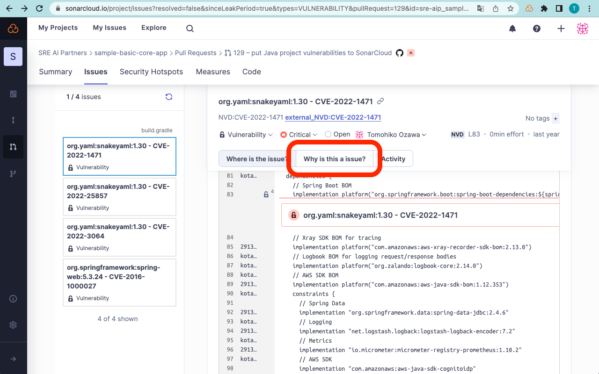
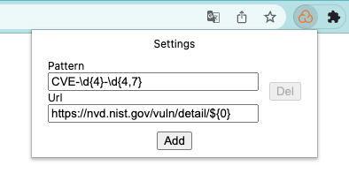

# sonarcloud-external-issue-helper-chrome-extension

[**SonarCloud External Issue Helper**](https://chrome.google.com/webstore/detail/sonarcloud-external-issue/fehamijffpnieljkmcmolakdfaeaooma)
is a Chrome extension to add missing "Why is this an issue?" tabs to [SonarCloud](https://sonarcloud.io/projects) for
external issues in [Generic issue data format](https://docs.sonarcloud.io/enriching/generic-issue-data/).

SonarCloud supports a generic format for importing issues generated by external analysis tools, like linters.
External issues have an important limitation that the activation of the rules that raise these issues cannot be managed
within SonarCloud.
So unlike the regular rule-based issues, "Why is this an issue?" tab (why-issue tab) is not available for
external issues.
This extension adds the same tab for external issues as a customizable link.



## Settings

The settings window is available from the extension icon.



### Entries

An entry consists of a pattern and a URL. You can have multiple entries.

#### Pattern

A regular expression used to match each issue message.

#### Url

A link URL of why-issue tab to be added when the pattern matched.
Capturing groups (ex: `${0}`, `${1}`) are available.

## Example

Suppose that you have imported external issues by converting the scan result of your SCA tool into the generic issue
data
format.
These issue message contain the vulnerable library name and the CVE number like this:

```
org.yaml:snakeyaml:1.30 - CVE-2022-1471
```

It will be useful if you can jump to the NVD vulnerability details page from the why-issue tab.

To match these issue messages, you can use the following regex pattern that matches CVE numbers.

```
CVE-\d{4}-\d{4,7}
```

And you can build URLs of NVD vulnerability details page using the capturing groups.
`${0}` means the whole matched string (CVE number).

```
https://nvd.nist.gov/vuln/detail/${0}
```

After reloading the SonarCloud issues page, you can see the why-issue tab which enables you to jump to the NVD
vulnerability details page!
